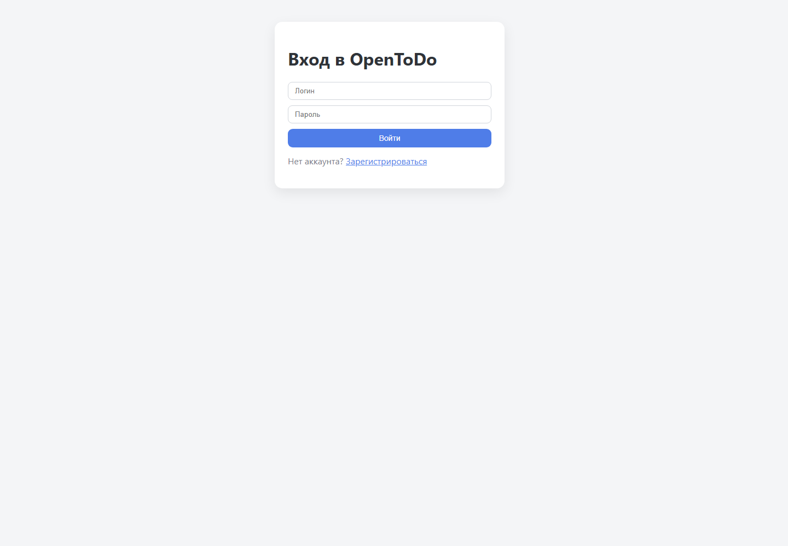
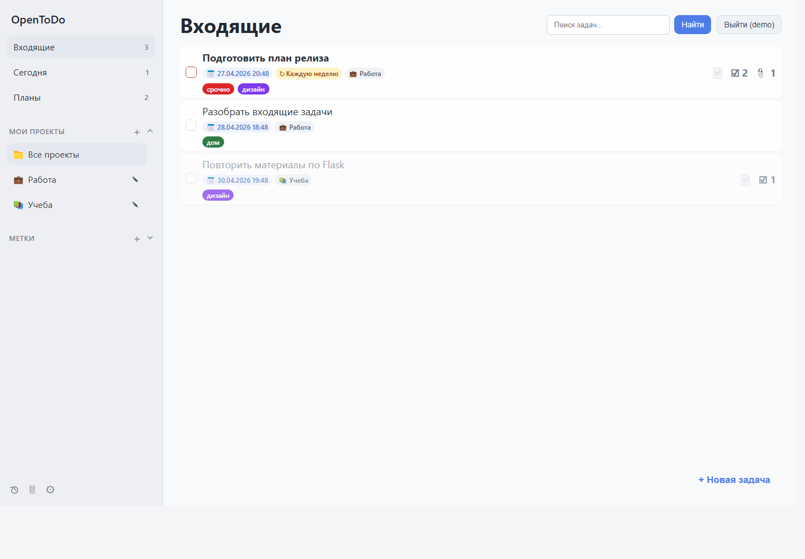

# OpenToDo

OpenToDo — локальное веб-приложение для управления личными задачами. Проект написан на Flask, хранит данные в SQLite через Flask-SQLAlchemy и запускается одним Python-процессом.

## Скриншоты

Форма входа:



Рабочий экран со списком задач, проектами, метками и поиском:



## Возможности

- регистрация, вход и выход пользователей;
- личные задачи для каждого пользователя;
- создание, редактирование, выполнение, архивирование, перенос в корзину и окончательное удаление задач;
- описание задачи, дата и время дедлайна, приоритет и повторение;
- представления «Входящие», «Сегодня», «Планы», «Архив» и «Корзина»;
- поиск по названию, описанию, проектам и меткам;
- проекты с иконками и фильтрация задач по проектам;
- цветные метки, автосоздание меток из формы задачи и фильтрация по меткам;
- чеклисты внутри задач;
- файловые вложения к задачам;
- импорт и экспорт резервных копий в JSON и ZIP с CSV-файлами;
- Telegram-напоминания о просроченных задачах;
- CSRF-защита POST-запросов и защищенные cookie-сессии;
- переключаемые темы интерфейса.

## Технологии

- Python;
- Flask;
- Flask-SQLAlchemy;
- APScheduler;
- SQLite;
- HTML, CSS и JavaScript;
- pytest.

## Установка

1. Создайте и активируйте виртуальное окружение:

```powershell
python -m venv .venv
.\.venv\Scripts\Activate.ps1
```

2. Установите зависимости:

```powershell
pip install -r requirements.txt
```

## Запуск

```powershell
python app.py
```

По умолчанию приложение запускается на `0.0.0.0:5000`. На локальной машине его можно открыть по адресу `http://localhost:5000`.

При запуске приложение автоматически создает недостающие таблицы и добавляет новые колонки для старых локальных баз.

## Тесты

```powershell
pytest
```

## Настройки окружения

Дополнительно можно задать переменные окружения:

- `SECRET_KEY` — секретный ключ Flask-сессий. Если не задан, генерируется временный ключ на время работы процесса;
- `FLASK_DEBUG=1` — включение debug-режима в конфигурации приложения;
- `FLASK_TEMPLATES_AUTO_RELOAD=1` — автообновление шаблонов;
- `SESSION_COOKIE_SECURE=1` — отправка cookie только по HTTPS;
- `FLASK_RUN_HOST` — хост для запуска приложения, по умолчанию `0.0.0.0`;
- `TELEGRAM_BOT_TOKEN` — fallback-токен Telegram-бота. Обычно токен задается пользователем в настройках приложения и хранится в базе;
- `NOTIFICATIONS_ENABLED=0` — отключение фоновой отправки Telegram-уведомлений;
- `NOTIFICATIONS_POLL_INTERVAL_SECONDS` — интервал проверки задач для уведомлений, по умолчанию 60 секунд, минимум 10 секунд.

Пример:

```powershell
$env:SECRET_KEY = "change-me"
$env:NOTIFICATIONS_POLL_INTERVAL_SECONDS = "30"
python app.py
```

## Ограничения

- База данных хранится локально в SQLite-файле `instance/todo.db`.
- К одной задаче можно прикрепить до 5 файлов.
- Размер одного вложения ограничен 10 МБ.
- Общий лимит HTTP-запроса задан в 25 МБ.

## Telegram-уведомления

В настройках приложения пользователь может указать токен Telegram-бота и `chat_id`. После включения уведомлений фоновый планировщик периодически ищет невыполненные задачи с наступившим временем дедлайна и отправляет напоминание в Telegram.

Если уведомление успешно отправлено, задача помечается как уже уведомленная. При изменении времени дедлайна отметка сбрасывается.

## Резервные копии

OpenToDo поддерживает экспорт данных пользователя в JSON и ZIP-архив с CSV-файлами. В резервную копию входят проекты, метки, задачи, чеклисты, связи задач с метками и вложения.

Импорт доступен в двух режимах:

- `merge` — добавить данные из backup к текущим данным;
- `replace` — очистить текущие данные пользователя и восстановить их из backup.

## Структура проекта

```text
app.py                    # точка входа приложения
requirements.txt          # Python-зависимости
opentodo/                 # основной пакет приложения
  blueprints/             # Flask blueprints для auth, задач, проектов, меток, backup и вложений
  models.py               # SQLAlchemy-модели
  db_init.py              # создание и простые миграции локальной SQLite-базы
  background_jobs.py      # запуск фонового планировщика уведомлений
  telegram_notifications.py
templates/                # HTML-шаблоны
static/                   # стили интерфейса
docs/screenshots/         # изображения для README
tests/                    # pytest-тесты
```
